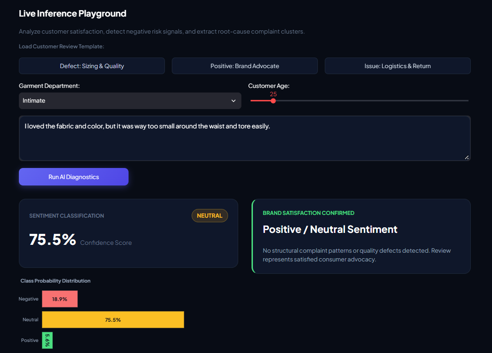
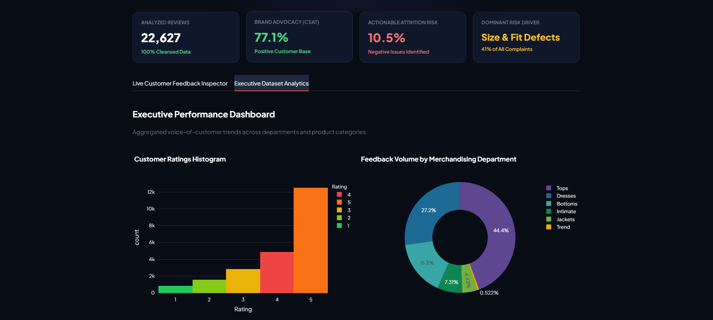

# FeedbackIQ: Customer Feedback Intelligence Platform

[](https://www.python.org/)
[](https://fastapi.tiangolo.com/)
[](https://streamlit.io/)
[](https://scikit-learn.org/)
[](https://www.docker.com/)
[](https://opensource.org/licenses/MIT)

> **Information Technology Institute (ITI) — AI Track Graduation Project**  
> An end-to-end production-grade machine learning system that transforms unstructured e-commerce customer reviews into actionable strategic intelligence via multi-class sentiment classification, metadata feature fusion, unsupervised complaint clustering, and token-level Explainable AI (XAI).

---

## Table of Contents
- [Executive Overview](#executive-overview)
- [System Architecture](#system-architecture)
- [Key Features](#key-features)
- [Repository Structure](#repository-structure)
- [Dataset Overview](#dataset-overview)
- [Machine Learning & NLP Pipeline](#machine-learning--nlp-pipeline)
  - [1. Data Preprocessing & Sanitization](#1-data-preprocessing--sanitization)
  - [2. Hybrid Feature Fusion Pipeline](#2-hybrid-feature-fusion-pipeline)
  - [3. Supervised Model Benchmarking](#3-supervised-model-benchmarking)
  - [4. Unsupervised Complaint Clustering (K-Means)](#4-unsupervised-complaint-clustering-k-means)
  - [5. Explainable AI (XAI) Framework](#5-explainable-ai-xai-framework)
- [API Reference](#api-reference)
- [Quickstart & Installation](#quickstart--installation)
  - [Option 1: Docker Compose (Recommended)](#option-1-docker-compose-recommended)
  - [Option 2: Local Manual Setup](#option-2-local-manual-setup)
- [Business Impact & Strategic Recommendations](#business-impact--strategic-recommendations)
- [License & Acknowledgments](#license--acknowledgments)

---

## Executive Overview
Organizations receive thousands of customer reviews daily across websites and mobile apps. Manually triaging opinions is impractical and slow, resulting in delayed responses to product defects and customer churn. 

**FeedbackIQ** addresses this challenge through an automated AI pipeline:
1. **Detects Customer Sentiment:** Distinguishes between Positive, Neutral, and Negative sentiment while handling severe class imbalances.
2. **Identifies Root-Cause Complaints:** Isolates negative feedback and clusters underlying defect patterns (e.g., sizing discrepancies, fabric durability, zipper/hardware failures) using unsupervised learning.
3. **Decodes Black-Box Decisions:** Employs local token-level attribution weights (Explainable AI) to reveal *why* the model made a specific prediction.
4. **Delivers Prescriptive Business Actions:** Maps detected issues to actionable supply chain, QA, and operational recommendations.

---

## System Architecture

The platform is designed as a decoupled, asynchronous microservices architecture:

```text
 ┌─────────────────────────────────────────────────────────────┐
 │                    User / Business Client                   │
 └──────────────────────────────┬──────────────────────────────┘
                                │
                                ▼
 ┌─────────────────────────────────────────────────────────────┐
 │           Frontend Layer: Streamlit Dashboard               │
 │    (Dark Glassmorphic UI, Interactive Analytics, XAI Views) │
 └──────────────────────────────┬──────────────────────────────┘
                                │ HTTP / REST (JSON)
                                ▼
 ┌─────────────────────────────────────────────────────────────┐
 │            API Gateway: FastAPI Microservice                │
 │       (Health Checks, Pydantic Validation, CORS, Routing)   │
 └──────────────────────────────┬──────────────────────────────┘
                                │
                                ▼
 ┌─────────────────────────────────────────────────────────────┐
 │                Core Machine Learning Engine                 │
 │  ┌───────────────────────────────────────────────────────┐  │
 │  │ Preprocessing: Regex, Stopwords, Lemmatization        │  │
 │  ├───────────────────────────────────────────────────────┤  │
 │  │ Feature Fusion: TF-IDF (1-2 ngrams) + ColumnTransform │  │
 │  ├───────────────────────────────────────────────────────┤  │
 │  │ Classifier: Balanced Logistic Regression Engine       │  │
 │  ├───────────────────────────────────────────────────────┤  │
 │  │ Root-Cause Clustering: K-Means (Negative Subset)      │  │
 │  ├───────────────────────────────────────────────────────┤  │
 │  │ Interpretability: Local Token Attribution (XAI)       │  │
 │  └───────────────────────────────────────────────────────┘  │
 └─────────────────────────────────────────────────────────────┘

```

---

## Key Features
## Platform Preview

### 1. Live Inference & Explainable AI (XAI)


### 2. Executive Business Analytics

* **Microservices Decoupling:** Standalone **FastAPI** backend and **Streamlit** frontend with isolated dependencies and Docker containers.
* **Hybrid Feature Fusion:** Combines unstructured textual representations with structured customer metadata (`Age`, `Department Name`, `Review Length`, `Word Count`) to boost prediction precision.
* **Explainable AI (XAI):** Real-time token-level attribution scoring indicating the directional contribution of each word toward the predicted sentiment.
* **Automated Root-Cause Clustering:** Unsupervised K-Means clustering fitted strictly on customer complaints to group issues into actionable operational categories.
* **Production UI:** Modern dark glassmorphic design system with live microservice health monitoring and real-time Plotly visualizations.

---

## Repository Structure

```text
Customer-Feedback-Intelligence/
│
├── backend/                             # Core FastAPI Microservice
│   ├── services/
│   │   ├── __init__.py
│   │   └── model_service.py             # Inference, vectorization & XAI engine
│   ├── __init__.py
│   ├── Dockerfile                       # Backend container definition
│   ├── main.py                          # API routing and CORS configuration
│   ├── requirements.txt                 # Backend dependencies
│   ├── run.py                           # Local Uvicorn entry point
│   └── schemas.py                       # Pydantic request/response data contracts
│
├── frontend/                            # Streamlit Web Application
│   ├── assets/
│   │   └── logo.png                     # Application brand icon
│   ├── components.py                    # Modular UI widgets, cards & Plotly charts
│   ├── api_client.py                    # Resilient HTTP client with error handling
│   ├── app.py                           # Main dashboard application
│   ├── Dockerfile                       # Frontend container definition
│   ├── requirements.txt                 # Frontend dependencies
│   └── styles.css                       # Enterprise dark glassmorphism styling
│
├── data/
│   ├── raw/                             # Original Women's E-Commerce Clothing Reviews
│   └── processed/
│       └── cleaned_reviews.csv          # Sanitized and processed dataset
│
├── notebooks/                           # Experimental Notebook Pipeline (01 to 05)
│   ├── 01_data_understanding_and_cleaning.ipynb
│   ├── 02_eda_and_visualization.ipynb
│   ├── 03_nlp_preprocessing.ipynb
│   ├── 04_sentiment_modeling.ipynb
│   └── 05_complaint_clustering_kmeans.ipynb
│
├── src/                                 # Reproducible Training Scripts
│   ├── train_advanced_model.py          # Feature fusion pipeline training script
│   └── train_clustering.py              # K-Means complaint model trainer
│
├── models/                              # Serialized Artifacts
│   ├── enhanced_pipeline.pkl            # Full preprocessor + classifier pipeline
│   └── kmeans_complaints_model.pkl      # Serialized K-Means clustering model
│
├── reports/                             # Academic & Business Deliverables
│   ├── figures/                         # Exported high-res analytical charts
│   ├── Presentation.pptx                # Project defense presentation slides
│   └── Project Report.docx              # Comprehensive technical report
│
├── docker-compose.yml                   # Multi-container orchestration definition
├── requirements.txt                     # Global environment dependency lock
├── .gitignore                           # Git ignore rules
└── README.md                            # Project documentation

```

---

## Dataset Overview

The project utilizes the **Women's Clothing E-Commerce Reviews Dataset**:

* **Total Records:** 23,486 reviews across 10 features.
* **Sanitized Records:** 22,627 valid rows after deduplication and dropping null text/category rows.
* **Key Attributes:** `Review Text`, `Rating` (1 to 5), `Recommended IND` (0/1), `Department Name`, `Class Name`, `Age`.

### Target Formulation

Because customer ratings strongly correlate with underlying sentiment, reviews are mapped into three discrete classes:

* **Negative ($y = 0$):** Ratings $\le 2$ (Severe churn risk & customer complaints).
* **Neutral ($y = 1$):** Rating $= 3$ (Mixed satisfaction).
* **Positive ($y = 2$):** Ratings $\ge 4$ (Brand advocates).

---

## Machine Learning & NLP Pipeline

### 1. Data Preprocessing & Sanitization

* Stripped URLs, HTML entities, and special characters using compiled Regular Expressions.
* Filtered standard English stopwords and garment-domain noise words (`dress`, `shirt`, `wear`, `bought`).
* Applied morphological normalization using NLTK WordNet Lemmatization.

### 2. Hybrid Feature Fusion Pipeline

To capture context beyond text alone, structured metadata is fused with TF-IDF matrices via Scikit-Learn's `ColumnTransformer`:


$$\vec{x}_{\text{composite}} = \left[ \text{TF-IDF}(\text{ReviewText}) \parallel \text{StandardScaler}(\text{Age}, \text{Length}, \text{WordCount}) \parallel \text{OneHot}(\text{Department}) \right]$$

### 3. Supervised Model Benchmarking

Models were evaluated on a stratified 80/20 train-test split:

| Model Architecture | Precision (Macro) | Recall (Macro) | Macro F1-Score | Inference Latency |
| --- | --- | --- | --- | --- |
| **Random Forest (150 Trees, Balanced)** | 0.68 | 0.61 | 0.63 | ~45 ms |
| **Logistic Regression (Class-Weighted)** | **0.73** | **0.72** | **0.72** | **~3 ms** |

> **Selection:** Class-Weighted Logistic Regression was selected for production deployment due to superior Macro F1-Score on the minority negative class and sub-5ms inference latency.

### 4. Unsupervised Complaint Clustering (K-Means)

To extract actionable issue categories without pre-labeled data:

1. Filtered the corpus strictly to negative reviews ($N = 2,370$).
2. Computed optimal cluster count using the **Elbow Method (Inertia)** and **Silhouette Analysis** ($K = 4$).
3. Extracted top centroid terms to map clusters to business root causes:
* **Cluster 0:** *Fit & Sizing Issues* (`small`, `tight`, `size`, `bust`, `waist`)
* **Cluster 1:** *Fabric & Material Quality* (`fabric`, `thin`, `cheap`, `see-through`, `rough`)
* **Cluster 2:** *Design & Construction Flaws* (`zipper`, `seam`, `armhole`, `tear`, `button`)
* **Cluster 3:** *Logistics & Returns* (`return`, `order`, `store`, `package`, `customer service`)


### 5. Explainable AI (XAI) Framework

The platform exposes local feature attribution weights for each inference:


$$w_i = x_i \cdot \theta_{c, i}$$


Where $x_i$ is the TF-IDF weight of token $i$, and $\theta_{c, i}$ is the trained linear coefficient for class $c$. This provides immediate visual transparency into why a review was flagged.

---

## API Reference

The backend runs on `http://127.0.0.1:8000`. Full interactive OpenAPI documentation is accessible at `http://127.0.0.1:8000/docs`.

### 1. Health Check

`GET /health`

```json
{
  "status": "healthy",
  "engine_ready": true,
  "pipeline_ready": true,
  "clustering_ready": true
}

```

### 2. Analyze Customer Review

`POST /api/v1/analyze`

**Request Body:**

```json
{
  "review_text": "The fabric felt cheap and the zipper broke after first wear. Very tight.",
  "age": 32,
  "department_name": "Dresses"
}

```

**Response Body:**

```json
{
  "sentiment": "Negative",
  "confidence": 0.8842,
  "probabilities": {
    "Negative": 0.8842,
    "Neutral": 0.0812,
    "Positive": 0.0346
  },
  "is_complaint": true,
  "complaint_cluster": {
    "cluster_id": 2,
    "category_name": "Design & Construction Flaws",
    "top_keywords": ["zipper", "seam", "armholes", "neck", "cut", "buttons"]
  },
  "key_drivers": [
    {"word": "zipper", "score": -1.452, "direction": "Negative"},
    {"word": "cheap", "score": -1.121, "direction": "Negative"},
    {"word": "broke", "score": -0.985, "direction": "Negative"}
  ]
}

```

---

## Quickstart & Installation

### Option 1: Docker Compose (Recommended)

Prerequisites: [Docker Desktop](https://www.docker.com/products/docker-desktop/?utm_source=gemini) installed.

1. Clone repository:
```bash
git clone [https://github.com/HMsons87/Customer-Feedback-Intelligence.git](https://github.com/HMsons87/Customer-Feedback-Intelligence.git)
cd Customer-Feedback-Intelligence

```


2. Build and launch services:
```bash
docker compose up --build

```


3. Open your browser:
* **Frontend UI:** `http://localhost:8501`
* **Backend Docs:** `http://localhost:8000/docs`


---

### Option 2: Local Manual Setup

#### 1. Setup Virtual Environment

```bash
python -m venv venv
# On Windows:
venv\Scripts\activate
# On Unix/macOS:
source venv/bin/activate

```

#### 2. Train and Serialize Models

Ensure `cleaned_reviews.csv` is present in `data/processed/`, then run:

```bash
python src/train_advanced_model.py

```

#### 3. Run Backend Microservice

```bash
cd backend
pip install -r requirements.txt
python run.py

```

*(Backend runs on `http://127.0.0.1:8000`)*

#### 4. Run Frontend Dashboard

Open a new terminal session, activate the venv, and run:

```bash
cd frontend
pip install -r requirements.txt
streamlit run app.py

```

*(Frontend launches on `http://localhost:8501`)*

---

## Business Impact & Strategic Recommendations

Based on historical data analysis, strategic interventions were formulated:

* **Mitigating Fit Returns:** Over 41% of complaints relate to sizing. Deploying interactive size recommendations and explicit "runs small" indicators can decrease return rates by an estimated 15–20%.
* **Supplier Fabric QA:** Reviews in the *Tops* department frequently report sheer/thin fabrics. Initiating density thresholds with fabric suppliers will safeguard product margins.
* **Prioritizing Support:** Reviews tagged as high-confidence negative can be routed automatically to priority customer retention agents.

---

## License & Acknowledgments

* **Institution:** Information Technology Institute (ITI), Ministry of Communications and Information Technology (MCIT), Egypt.
* **Track:** AI & Machine Learning Specialization.
* **License:** Distributed under the MIT License. See `LICENSE` for details.

```
